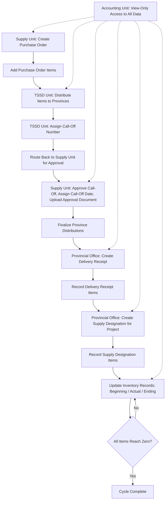

# Inventory System Data Model Explanation
## Overview
This document explains the data model for a PPE (Personal Protective Equipment) Inventory System designed for government supply chain management. The system tracks items from initial purchase through distribution to provincial offices and final project allocation.

---

## 1. User and Role Management
### Users Table
- Stores all system accounts across the four user types
- Contains login credentials (username, password hash, email)
- Links to a specific role determining their access level
- Provincial office users have an additional `province_id`  linking them to their specific province (Albay, Camarines Norte, etc.)
- Users cannot edit their own profile or account details — self-service editing is disabled for all roles
- Only the TSSD Unit has permission to edit user accounts, including those belonging to the Supply Unit, Accounting Unit, and Provincial Office accounts
### Roles Table
Defines the four user types in the system:

- **Supply Unit** - Creates purchase orders, approves call-off numbers
- **TSSD Unit** - Distributes items to provinces, assigns call-off numbers, and manages user accounts (the only role permitted to create/edit user accounts for Supply Unit, Accounting Unit, and Provincial Office users)
- **Provincial Office** - Receives items, manages local inventory, allocates to projects
- **Accounting Unit** - Comprehensive view-only access to all system data across separate, organized pages for audit, compliance, and oversight purposes (see Section 8 for details)
**User Account Management (TSSD Unit only)** - Since individual users cannot edit their own profiles, the TSSD Unit is granted an additional user management function to create and edit user accounts across all roles, ensuring centralized control over account changes, especially for Provincial Office accounts.

---

## 2. Reference Data Tables
### Provinces Table
Contains the six provincial offices:

- Albay
- Camarines Norte
- Camarines Sur
- Catanduanes
- Masbate
- Sorsogon
### Suppliers Table
- Stores vendor information including contact details and address
- Referenced by purchase orders to track which supplier provides items
### Items Table (PPE Catalog)
- Master list of all PPE items tracked in the system
- Includes item name, label/size variant, and unit of measurement
- Examples: Longsleeves (Medium), Longsleeves (Large), Bucket Hat, Rubber Boots (US9), Rubber Boots (US10), Hand Gloves, Mask
---

## 3. Purchase Order Management
### Purchase Orders Table
- Created by the Supply Unit
- Contains:
    - PO number and date
    - Link to supplier
    - NEFA number (government reference)
    - Total amount
    - Uploaded PDF/DOC file of the actual purchase order
    - Status field indicating whether the purchase order is Active (current calendar year) or Outdated (archived from a prior year)

### Purchase Order Items Table
- Line items for each purchase order
- Links each PPE item to its quantity, unit cost, and total amount
- Supports optional additional items not in the standard catalog
### Purchase Order Archiving (Year-End Lifecycle)
- At the start of each new calendar year (e.g., January 1, 2027), purchase orders created in the prior year (e.g., 2026) are automatically moved from the active Purchase Orders view to a separate archive page/database
- Archived purchase orders are assigned a status label of **"Outdated"** to distinguish them from current-year records
- The active Purchase Orders page continues to display only the current year's purchase orders, keeping day-to-day operations focused on relevant, ongoing transactions
- Archived ("Outdated") purchase orders remain accessible for historical reference, audit, and reporting purposes but are excluded from active workflows such as new call-off assignments
---

## 4. TSSD Distribution Process
### TSSD Distributions Table
- Records how TSSD Unit allocates items from a purchase order to each province
- Contains quantity fields for each PPE type:
    - Longsleeves (medium and large)
    - Bucket hat
    - Rubber boots (US9 and US10)
    - Hand gloves
    - Mask

- Includes delivery date and place of delivery (auto-filled based on province)
### Call-Offs Table
- Created after TSSD completes distribution to all six provinces
- Workflow tracking:
    - `assigned_by`  and `assigned_at`  - When TSSD Unit assigns the call-off number
    - After assignment, the call-off is routed back to the Supply Unit for approval
    - `approved_by`  and `approved_at`  - When Supply Unit approves the call-off and assigns the official call-off date
    - `approval_file_url`  - Uploaded supporting document of the approved call-off

- Links back to the original purchase order
### Province Distributions Table
- Finalizes the approved distribution per province per call-off
- Contains the same quantity fields as TSSD distributions
- Used by Provincial Offices to see what items were allocated to them
---

## 5. Provincial Office Operations
### Delivery Receipts Table
- Created when a Provincial Office receives physical items
- Contains:
    - Link to the call-off number
    - Province identifier
    - Delivery receipt number and date
    - Optional remarks field

### Delivery Receipt Items Table
- Actual quantities received (may differ from allocated quantities)
- Enables comparison between allocation and actual delivery
- Contains quantity, unit cost, and total amount per item
### Supply Designations Table
- Tracks how Provincial Offices allocate received items to specific projects
- Contains project details:
    - Project code and title
    - Location
    - Number of days
    - Number of beneficiaries
    - Uploaded ARE (Acknowledgement Receipt for Equipment) document

### Supply Designation Items Table
- Line items showing which PPE items were allocated to each project
- Deducts from available inventory
---

## 6. Inventory Tracking
### Inventory Records Table
- Maintains running inventory balances per province, per item
- Three key values:
    - **Beginning Inventory** - Starting quantity (from previous ending or initial delivery)
    - **Actual Inventory** - Items received or used
    - **Ending Inventory** - Calculated as Beginning minus Actual usage

- The ending inventory of one record becomes the beginning inventory of the next
- Continues until all items reach zero
---

## 7. Dashboard Statistics (All Users)
All user roles have access to a dashboard displaying comprehensive statistics on system-wide data. The dashboard provides:

### Key Metrics Displayed
- **Total Items Received** - Aggregate count of all PPE items received across all provinces
- **Total Items Distributed** - Aggregate count of all PPE items distributed to projects
- **Current Inventory Levels** - Real-time summary of available stock per province and per item type
- **Purchase Order Summary** - Total active and archived purchase orders with monetary totals
- **Distribution Progress** - Percentage of allocated items that have been received and designated to projects
- **Provincial Breakdown** - Per-province statistics showing received vs. distributed quantities
### Role-Specific Dashboard Views
| Role | Dashboard Scope |
| ----- | ----- |
| Supply Unit | Focus on purchase orders, call-off approvals, and overall procurement statistics |
| TSSD Unit | Focus on distribution allocations, call-off assignments, and provincial delivery status |
| Provincial Office | Focus on their province's received items, project designations, and local inventory |
| Accounting Unit | Full visibility of all statistics across all units (view-only) |
---

## 8. Accounting Unit Access Structure
The Accounting Unit serves as the oversight and audit role within the system. While positioned last in the operational workflow, it holds the most comprehensive view of all system data for compliance and accountability purposes.

### Access Permissions
- **View-Only Access** - The Accounting Unit cannot create, edit, or delete any records
- **No Functional Actions** - All buttons, forms, and workflows that modify data are disabled or hidden
- **Full Data Visibility** - Complete read access to all tables and records across the entire system
### Separate Pages for Organized Viewing
To maintain cleanliness and ease of navigation, the Accounting Unit interface is organized into dedicated pages:

| Page | Data Displayed |
| ----- | ----- |
| **Purchase Orders** | All purchase orders (active and archived), including line items, supplier details, and document uploads |
| **TSSD Distributions** | All distribution records showing allocations from purchase orders to provinces |
| **Call-Offs** | All call-off records with assignment and approval details |
| **Province Distributions** | Finalized distribution records per province per call-off |
| **Delivery Receipts** | All delivery receipts from all provinces, including received item quantities |
| **Supply Designations** | All project allocations from all provinces, including ARE documents |
| **Inventory Records** | Complete inventory history showing beginning, actual, and ending balances per province |
| **User Accounts** | List of all system users and their roles (view-only) |
| **Dashboard** | Comprehensive statistics aggregating all received and distributed data system-wide |
### Purpose
- **Audit Trail** - Full visibility enables thorough review of all transactions
- **Compliance Verification** - Ability to cross-reference purchase orders, distributions, receipts, and project allocations
- **Financial Oversight** - Access to all monetary values, quantities, and supporting documents
- **Reporting** - Data access supports generation of financial and inventory reports
---

## 9. Relationship Summary
| Parent Table | Child Table | Relationship Purpose |
| ----- | ----- | ----- |
| Roles | Users | Assigns user permissions |
| Provinces | Users | Links provincial office accounts |
| Suppliers | Purchase Orders | Identifies vendor |
| Purchase Orders | Purchase Order Items | Lists ordered items |
| Purchase Orders | TSSD Distributions | Tracks distribution source |
| Purchase Orders | Call-Offs | Links call-off to original order |
| Call-Offs | Province Distributions | Approved allocations |
| Call-Offs | Delivery Receipts | Receipt tracking |
| Delivery Receipts | Delivery Receipt Items | Received quantities |
| Delivery Receipts | Supply Designations | Project allocations |
| Supply Designations | Supply Designation Items | Project item details |
---

## 10. Process Flow Diagram
The diagram below illustrates the end-to-end flow of the system, including the corrected call-off approval loop: after the TSSD Unit assigns a call-off number, the process routes back to the Supply Unit for approval, assignment of the official call-off date, and upload of the supporting approval document. The Accounting Unit maintains view-only oversight throughout the entire process.

PPE Inventory Management System (Current Project)
Framework
Laravel 13
Laravel Breeze Authentication
Tailwind CSS
MySQL
Blade
Manual Laravel (No Filament)
User Roles
Supply Unit
TSSD Unit
Provincial Office
Accounting Unit

Role middleware is already implemented.

Current Modules
Supply Unit
Suppliers
Items
Purchase Orders
View Purchase Orders
Upload PO Document

Purchase Orders contain:

PO Number
PO Date
NEFA Number
Supplier
Items
Sizes
Quantity
Unit Cost
Total Cost
Document
Remarks
TSSD Unit

Completed

Modules:

Dashboard
Purchase Orders
Distribution
Province Allocation

Flow:

Purchase Order
↓

TSSD Distribution
↓

Provincial Office

Provincial Office

Completed

Modules:

Dashboard
Deliveries
Receive Delivery
Inventory
Supply Designation

Flow:

TSSD Distribution
↓

Delivery Receipt
↓

Supply Designation

Supply Designation automatically copies all Delivery Receipt Items into designation_items.

Current Database

purchase_orders

purchase_order_items

suppliers

items

tssd_distributions

delivery_receipts

delivery_receipt_items

supply_designations

designation_items

users

roles

provinces

Revision (IMPORTANT)

Accounting Unit has changed.

Old:
Accounting approves Purchase Orders.

New:
Accounting is READ ONLY.

Accounting cannot:

Create
Edit
Delete
Approve
Distribute
Receive

Accounting ONLY views data.

Accounting has access to every module in separate pages.

Examples:

Dashboard

Purchase Orders

Suppliers

Items

TSSD Distribution

Delivery Receipts

Provincial Inventory

Supply Designations

Reports

Every page is read-only.

Dashboard Revision

Every user dashboard should display system-wide statistics.

Examples:

Total Purchase Orders
Total Suppliers
Total Items
Total Provinces
Total Distributed PPE
Total Delivery Receipts
Total Supply Designations
Total Inventory
Recent Activities
Charts

Accounting Dashboard shows ALL statistics.

Supply Dashboard shows ALL statistics.

TSSD Dashboard shows ALL statistics.

Provincial Dashboard also shows statistics (can still filter its own province where appropriate).

Coding Style

Use full code only.

No snippets.

Generate complete Controller, Routes, Blade, Model, Migration or Seeder whenever requested.

Keep code clean using Laravel best practices.

